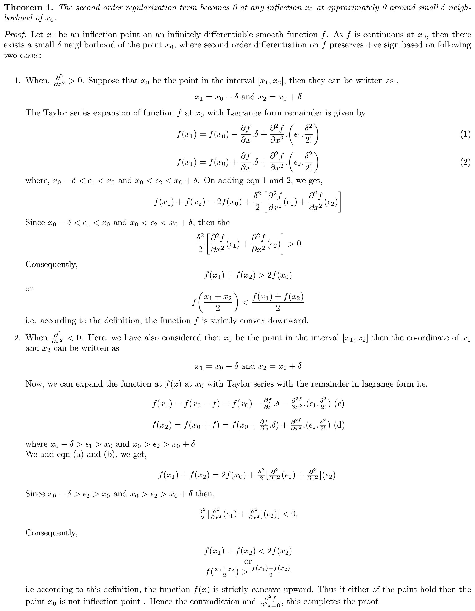
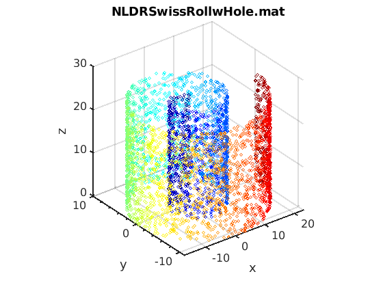
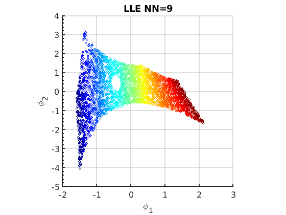
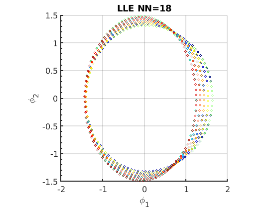

# Regularization on rapidly varying manifold
A higher order Third derivative(Jerk) baseed regularization technique has been proposed that expolits the information resides on the inflection points of the manifold which vanishes when computed with second order based regularization techniuque.

## The second order based manifold regularization techniques(Laplacian and Hessian) vanishes on the point of inflection. To take into account these data points on manifold, the third order (Jerk) based regularization has been proposed which can acommadate the information laying on these points. 
The following theorm explains the third order comptation on infection   
</img>

## How to use?
Run **nldr_interactive.m** file to open the interactive window. 

<table border ="1" align ="center">
  <tr>
    <td></img></td>
    <td></img></td>
    <td></img></td>
	<td></img></td>
    <td></img></td>
    <td></img></td>
	<td></img></td>
  </tr>
   <tr>
    <td></img></td>
    <td></img></td>
    <td></img></td>
	<td></img></td>
    <td></img></td>
    <td></img></td>
	<td></img></td>
  </tr>
   <tr>
    <td></img></td>
    <td></img></td>
    <td></img></td>
	<td></img></td>
    <td></img></td>
    <td></img></td>
	<td></img></td>
  </tr>
   <tr>
    <td></img></td>
    <td></img></td>
    <td></img></td>
	<td></img></td>
    <td></img></td>
    <td></img></td>
	<td></img></td>
  </tr>
   <tr>
    <td></img></td>
    <td></img></td>
    <td></img></td>
	<td></img></td>
    <td></img></td>
    <td></img></td>
	<td></img></td>
  </tr>
   <tr>
    <td></img></td>
    <td></img></td>
    <td></img></td>
	<td></img></td>
    <td></img></td>
    <td></img></td>
	<td></img></td>
  </tr>
</table>